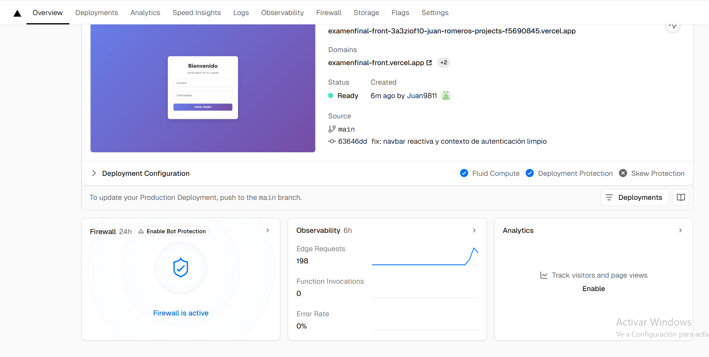

# Frontend - Sistema de Gestión de Profesores

Este es el frontend de la aplicación de gestión de profesores, desarrollado en React + TypeScript + Vite.

## 🚀 Despliegue
- **Vercel:** [Enlace al frontend desplegado](https://examenfinal-front.vercel.app/login)

## 📦 Instalación local
1. Clona el repositorio:
   ```bash
   git clone https://github.com/Juan9811/examenfinalFront.git
   ```
2. Entra a la carpeta del frontend:
   ```bash
   cd FrontEnd
   ```
3. Instala dependencias:
   ```bash
   npm install
   ```
4. Ejecuta en modo desarrollo:
   ```bash
   npm run dev
   ```

## ⚙️ Variables de entorno
Crea un archivo `.env` si necesitas configurar la URL del backend:
```
VITE_API_URL=https://examenfinalback-1.onrender.com
```

## 🖥️ Capturas y monitoreo
- )
- )
- [Panel de Vercel]()

---
- [Repositorio Backend](https://github.com/Juan9811/examenfinalBack)
